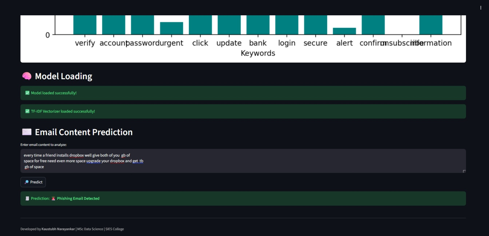
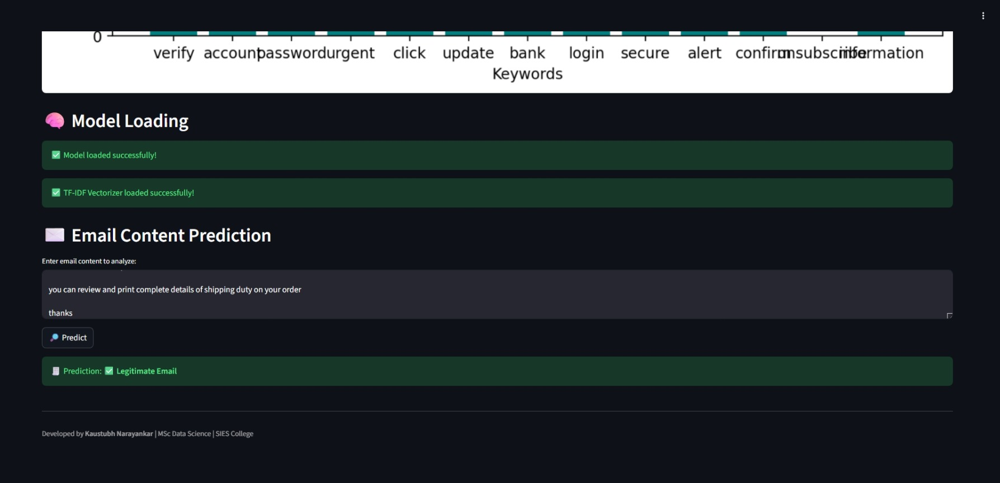

# phishing-email-detection-using-ml-dl
End-to-end phishing email detection system using machine learning and deep learning models including BERT, LSTM, and XGBoost, with real-time prediction deployed using Streamlit.

# Phishing Email Detection using Machine Learning and Deep Learning

## Abstract
Phishing emails are a major cybersecurity threat, exploiting users to obtain sensitive information. This project presents an automated phishing email detection system using Natural Language Processing, Machine Learning, and Deep Learning techniques. Multiple models including Logistic Regression, XGBoost, LSTM, and BERT were implemented and evaluated. Experimental results show that transformer-based models outperform traditional approaches. A real-time phishing detection system was deployed using Streamlit.

---

## 1. Introduction
The increasing volume and complexity of phishing attacks make manual detection ineffective. Automated detection systems using NLP and data-driven models provide scalable and reliable solutions. This project focuses on building an end-to-end phishing email classification pipeline from data preprocessing to deployment.

---

## 2. Methodology

### 2.1 Dataset Collection
A labeled dataset consisting of phishing and legitimate email text was used. Data augmentation techniques were applied to improve generalization.

### 2.2 Data Preprocessing
Text preprocessing included normalization, tokenization, stopword removal, and text cleaning to prepare data for modeling.

### 2.3 Feature Engineering
- TF-IDF for traditional machine learning models  
- Word embeddings for deep learning models  

### 2.4 Model Development
The following models were trained and evaluated:
- Logistic Regression  
- XGBoost  
- LSTM  
- BERT  

### 2.5 Evaluation Metrics
Model performance was measured using:
- Accuracy  
- Precision  
- Recall  
- F1-Score  
- ROC-AUC  

---

## 3. Results
- Traditional machine learning models provided strong baseline performance  
- Deep learning models significantly improved classification accuracy  
- BERT achieved the highest accuracy and robustness across all evaluation metrics  

---

## 4. System Implementation
A Streamlit web application was developed to enable real-time phishing detection. Users can input email text and receive instant classification results.

---

Phishy Email Detected :  

Legitimate Email Detected : 

## Project Architecture
Raw Email Dataset
      |
      v
Text Preprocessing
(Tokenization, Stopwords, Cleaning)
      |
      v
Feature Engineering
(TF-IDF | Word Embeddings)
      |
      v
Model Training
(Logistic Regression | XGBoost | LSTM | BERT)
      |
      v
Model Evaluation
(Accuracy, Precision, Recall, F1, ROC-AUC)
      |
      v
Best Model Selection
      |
      v
Streamlit Web Application
(Real-time Email Classification)

---

## 5. Conclusion
This project demonstrates the effectiveness of NLP-based deep learning models for phishing email detection. Transformer models such as BERT outperform traditional classifiers and offer strong potential for real-world cybersecurity applications.

---

## Future Enhancements
- Multilingual phishing email detection  
- Integration with live email systems  
- Model optimization for faster inference  

---

---

## Why This Project Matters
- Solves a real-world cybersecurity problem  
- Demonstrates NLP, Machine Learning, and Deep Learning expertise  
- Covers full project lifecycle from data processing to deployment  

---

## Author
**Kaustubh Narayankar**  
Data Science Graduate  

